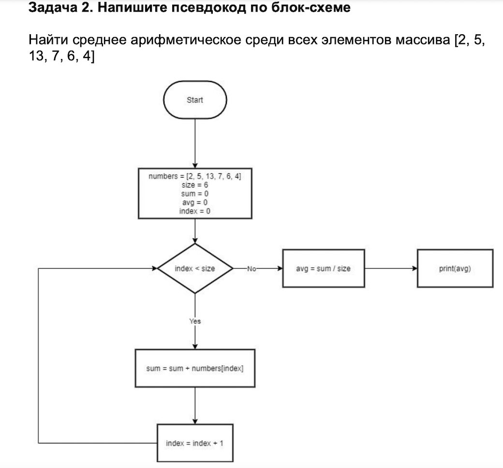

# **Что такое Git и зачем он нужен?**

Git - это консольная утилита для отслеживания и ведения истории изменения файлов в нашем проекте. Чаще всего его используют для кода, но можно и для других файлов. Например, для картинок - полезно для дизайнеров.

С помощью Git мы можем откатить свой проект до более старой версии, сравнивать, анализировать или сливать свои изменения в репозиторий

 **Рассмотрим основные команды Git:**
Для того чтобы инициализировать папку, сделать ее репозиторием используем команду 

    git init

Чтобы установить имя пользователя и потом отслеживать кто внес изменения необходимо указать свое имя и контакты через следующие команды:

    git config --global user.name "<Имя>"
    git config --global user.email "<адрес почты>"

 Для того чтобы сохранить файл используем следюущую команду:

    git add
*Пишем команду git add и добавляем наименование папки, нажимая клавишу таб*

Далее для того чтобы пояснить данное сохранение, написать комментарий мы используем:

    git commit
*Пишем следующим образом: Git commit -m "Описали команду Git coomit". Символ m указывает нам на то что мы пишем месседж. Можно написать am, что означает сохранить и написать месседж.*

***!!! Когда мы хотим сделать сохранение, используя команду "Git add" нужно сначала нажать комбинацию клавиш command-S (для тех кто исопльзует macbook)***

Для того, чтобы узнать информацию о статусе файла мы используем команду

    git status
Командa показывает какие файлы изменены, но не сохранены. Выводятся подсказки как изменить состояние файла

Для просмотра версий изменений используем команду

    git log
Команда выдаст кучу текста и много коммендариев. Но для удобства и сокращения можно использовать команду 

    git --oneline

Для того чтобы открыть определенную версию изменений используем команду 

    git checkout
*Набираем данную команду и номер коммита*

Для того чтобы вернуться к актуальной версии используем команду

    git checkout master

Для того чтобы посмотреть разницу между текущим состояние файла и изменением используем команду

    git dif

# **Ветвления**

Ветвления нужны для того чтобы работать в черновиках

Команды для того, чтобы работать с ветвлениями: 

1. Git branch name

Чтобы создать ветку нужно ввести следующую команду и добавить имя ветки:

    Git branch <name>
2. git checkout name
3. git merge name 
4. git branch -d 