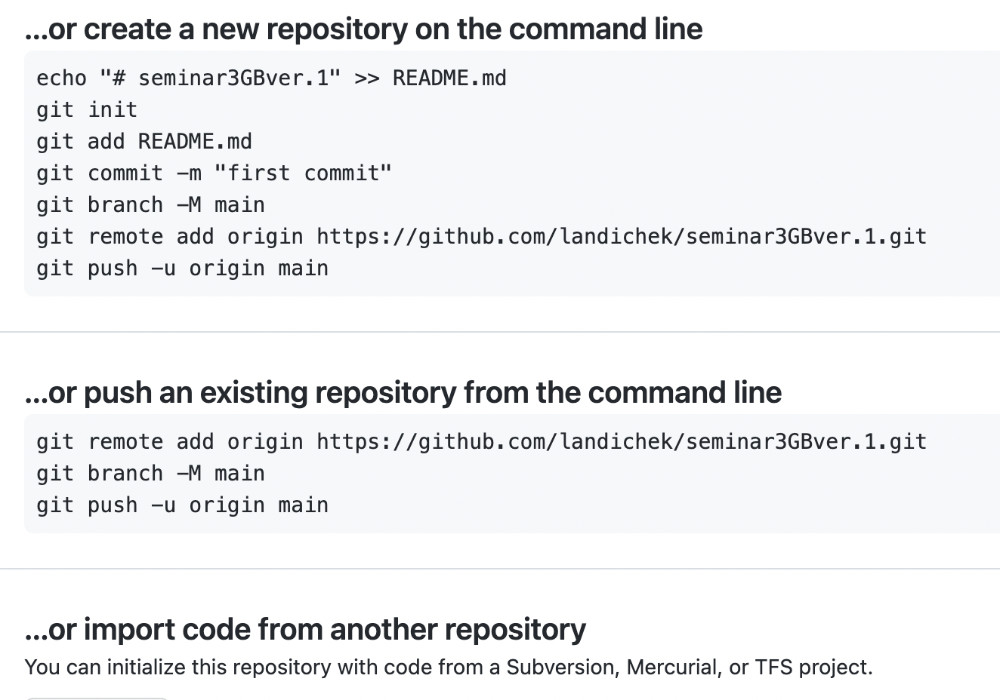

# **Что такое Git и зачем он нужен?**

Git - это консольная утилита для отслеживания и ведения истории изменения файлов в нашем проекте. Чаще всего его используют для кода, но можно и для других файлов. Например, для картинок - полезно для дизайнеров.

С помощью Git мы можем откатить свой проект до более старой версии, сравнивать, анализировать или сливать свои изменения в репозиторий

 **Рассмотрим основные команды Git:**
Для того чтобы инициализировать папку, сделать ее репозиторием используем команду 

    git init

Чтобы установить имя пользователя и потом отслеживать кто внес изменения необходимо указать свое имя и контакты через следующие команды:

    git config --global user.name "<Имя>"
    git config --global user.email "<адрес почты>"

 Для того чтобы сохранить файл используем следюущую команду:

    git add
*Пишем команду git add и добавляем наименование папки, нажимая клавишу таб*

Далее для того чтобы пояснить данное сохранение, написать комментарий мы используем:

    git commit
*Пишем следующим образом: Git commit -m "Описали команду Git coomit". Символ m указывает нам на то что мы пишем месседж. Можно написать am, что означает сохранить и написать месседж.*

***!!! Когда мы хотим сделать сохранение, используя команду "Git add" нужно сначала нажать комбинацию клавиш command-S (для тех кто исопльзует macbook)***

Для того, чтобы узнать информацию о статусе файла мы используем команду

    git status
Командa показывает какие файлы изменены, но не сохранены. Выводятся подсказки как изменить состояние файла

Для просмотра версий изменений используем команду

    git log
Команда выдаст кучу текста и много коммендариев. Но для удобства и сокращения можно использовать команду 

    git --oneline

Для того чтобы открыть определенную версию изменений используем команду 

    git checkout
*Набираем данную команду и номер коммита*

Для того чтобы вернуться к актуальной версии используем команду

    git checkout master

Для того чтобы посмотреть разницу между текущим состояние файла и изменением используем команду

    git dif

 

# **Ветвления**

Ветвления нужны для того чтобы работать в черновиках

Команды для того, чтобы работать с ветвлениями: 

1. Для того чтобы создать новую ветку необходимо воспользоваться следующей командой и добавить имя новой ветки

       git branch <name>

2. Для того чтобы перейти с одной ветки на другую нужно воспользовать следующей командой и добавить имя ветки 

       git checkout <name>

3. Чтобы сделать слияние двух веток, нужно сначала через команду гитчекаут перейти в ветку, где куда мы хотим переместить текст, а потом набрать следующую команду и добавить имя ветки, с которой перемещаем текст 

       git merge <name>

4. Когда переместили текст с одной ветки в другую, ненужную ветку можно удалить, воспользовавшись командой:

       git branch -d <name>

## **_Работа с GitHub_**

Команда init создает папку репозиторий локально на нашем компьютере. Для того чтобы работать в удаленной папке нужно зайти на сайт GitHub. Это нужно для того, чтобы мы смогли зайти в свою папку удаленно. Например, пошли к другу и не взяли с собой комп. Мы можем зайти на Гитхаб и внести все соответствующие изменения или просто посмотреть что нужно и т.д.

Для того чтобы репозиторий оказалался на Гитхабе нужно:

1. Создать аккаунт на сервисе
2. В правом верхнем углу кликаем "+", выбираем имя и все параметры по умолчанию
3. Гитхаб покажет несколько вариантов создания репозитория. Первый - создать новый абсолютно на гитхаб. Второй - когда у нас уже есть готова папка и необходимо ее загрузить в гитхаб. Копируем каждую с ссылку в VSC. Главно обратить внимание на название ветки (на рызнах копьютерах показывает по разному: ветка main или master)

    

4. Дружим гитхаб и VSC.

# **Загрузка изменений в удаленный репозиторий**

Загрузка новых изменений в удаленный репозиторий
Для того чтобы загрузить свои данные с локального репозитория в удаленный нужно воспользоваться командой

    git push

_Нужно просто написать эту команду без каких-то дополнительный наименований, ссылок_

# **Перенос изменений с удаленного репозитория в локальный**

Для того чтобы стянуть изменения с удаленного репозитория в локальный нужно воспользоваться командой:

    git pull

